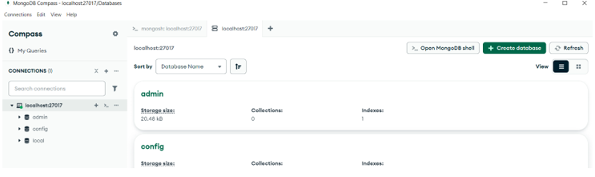
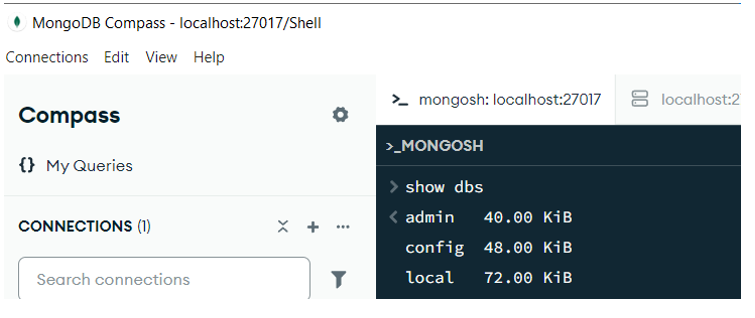
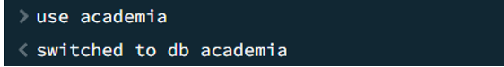
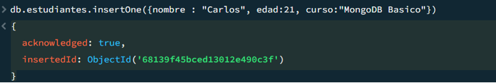
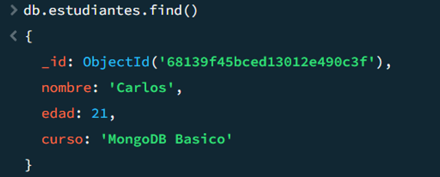

# ¿Qué es MongoDB?

Es un sistema de bases de datos NoSQL (o sea, no relacional).  
En lugar de guardar la información en tablas (como lo haría MySQL o SQL Server), MongoDB guarda los datos en documentos parecidos a JSON (un formato de texto estructurado en llaves {}).

Cada "documento" en MongoDB puede tener estructura propia y flexible.  
Por eso es ideal para trabajar con datos dinámicos, grandes volúmenes o cuando no quieres que todos los registros tengan exactamente las mismas columnas.

¿Cómo funciona MongoDB a grandes rasgos?

- Guarda la información en documentos.
- Los documentos se agrupan en colecciones (que sería el equivalente a las "tablas" en una base de datos relacional).
- Utiliza Mongo Query Language (MQL) en lugar de SQL tradicional para hacer consultas.
- Es muy popular en aplicaciones web modernas, especialmente cuando usas Node.js, Express, React, Angular, etc.

## Comparativa con Base de datos Relacionales

| **Modelo Relacional (SQL)** | **MongoDB (NoSQL)** | **Descripción** |
| --- | --- | --- |
| Base de datos | Base de datos | Igual en ambos modelos. |
| Tabla | Colección | Conjunto de documentos (equivale a una tabla en SQL). |
| Fila o registro | Documento | Unidad de información en formato JSON/BSON. |
| Columna | Campo o clave (key) | Cada par clave-valor dentro de un documento. |
| Llave primaria | \_id | Identificador único de cada documento (se genera por defecto). |
| Relación | Embebida o referenciada | Se logra embebiendo documentos o usando referencias (\_id). |
| Esquema | Esquema flexible (opcional) | No obligatorio; puede variar documento a documento. |

**Ejemplo visual sencillo**:

En una base de datos relacional (como SQL Server), se tendría algo como aparece a continuación:

| **id** | **nombre** | **edad** |
| --- | --- | --- |
| 1   | Ana | 25  |

**En MongoDB**, ese mismo dato se guardaría así:
```
{

"id": 1,

"nombre": "Ana",

"edad": 25

}
```
**¿Dónde se usa MongoDB?**

- Aplicaciones web y móviles modernas.
- Plataformas que manejan muchos datos de diferentes formas (por ejemplo, redes sociales, catálogos de productos, sistemas de recomendación).
- Proyectos donde la estructura de la información puede cambiar frecuentemente.

## Instalación de MongoDB en Windows

**1\. Descargar MongoDB**

- ir a la página oficial: <https://www.mongodb.com/try/download/community>
- Escoge:
  - **Version**: La última estable (por ejemplo, 7.0.x).
  - **OS**: Windows.
  - **Package**: _MSI Installer_ (muy fácil de instalar).

Haz clic en **Download**.

**2\. Ejecutar el Instalador**

Cuando el archivo .msi se descargue:

- **Haz doble clic** en el archivo.
- Se abrirá el instalador de MongoDB.
- **Sigue estos pasos**:
  - **Next**.
  - Acepta los términos (**I accept...**) → **Next**.
  - Elige **Complete** instalación (te instala todo lo necesario).
  - **Importante**: Deja seleccionada la opción "**Install MongoDB as a Service**" (esto hace que MongoDB arranque automáticamente en tu máquina).
  - También puedes dejar marcada "**Install MongoDB Compass**" si quieres (es una herramienta visual para manejar MongoDB de forma gráfica).

**3\. Finalizar Instalación**

- Clic en **Install**.
- Espera que termine.
- Clic en **Finish**.

¡Ya tienes MongoDB instalado en tu equipo!

**4\. Verificar que MongoDB está funcionando**

Ahora vamos a verificar:

- Abre **Símbolo del sistema** (**cmd**).
- Escribe:

mongo --version

o

mongod --version

Si ves un número de versión, por ejemplo, MongoDB shell version v7.0.2, ¡todo está bien!

**5\. ¿Cómo iniciar MongoDB manualmente (por si acaso)?**

Aunque MongoDB normalmente se ejecuta como servicio automáticamente, puedes iniciarlo manualmente:

- Crea una carpeta en tu disco para que MongoDB guarde datos. Por ejemplo:

mkdir C:\\data\\db

MongoDB necesita ese directorio para funcionar.

Luego ejecuta en consola:

mongod --dbpath C:\\data\\db

Con eso tu servidor MongoDB estará corriendo y podrás empezar a usarlo.

## Interactuando con MongoDB Compass

**1\. Verifica la instalación y conecta**

- Abre MongoDB Compass y procedemos a abrir el mongoDB Shell:



Esto inicia el shell interactivo de MongoDB.

Si deseamos ver las bases de datos que se han creado hasta el momento:

- show dbs



**2\. Crea una base de datos y colección**

- Cambia o crea una nueva base:![Texto


- Crea una colección insertando un documento:
  - db.estudiantes.insertOne({ nombre: "Carlos", edad: 21, curso: "MongoDB Básico" })

Ahora bien, un **documento en MongoDB** es una unidad de datos en formato **JSON** (internamente BSON) que almacena información estructurada como pares clave-valor. Es equivalente a una fila en una base de datos relacional, pero puede contener datos anidados y arrays.

La ejecución de la anterior sentencia nos dio como resultado lo siguiente:



Desglosemos la anterior consulta:

- **acknowledged: true**  
    MongoDB **confirma** que recibió y procesó correctamente la operación de inserción.
- **insertedId**  
    Es el **identificador único (\_id)** que MongoDB asignó automáticamente al documento insertado.  
    Se representa como un **ObjectId**, que es un tipo especial de MongoDB que incluye marca de tiempo, identificador del servidor, etc.

Ahora bien como sería la inserción de múltiples documentos en una colección:

db.estudiantes.insertMany(\[

{ nombre: "Ana Gómez", edad: 20 },

{ nombre: "Carlos Pérez", edad: 22, curso: "Node.js" },

{ nombre: "Laura Martínez", ciudad: "Cali", curso: "React" },

{ nombre: "Juan Rodríguez", edad: 24, curso: "Python", ciudad: "Barranquilla", telefono: "3001234567" },

{ nombre: "Luisa Torres", edad: 21, curso: "Express.js", direccion: { ciudad: "Manizales", calle: "Calle 10 #5-30" } },

{ nombre: "Daniela Suárez", edad: 23, curso: "Angular", ciudad: "Bogotá", notas: \[4.5, 4.8, 5.0\] },

{ nombre: "Andrés Castillo", edad: 25 },

{

nombre: "María José Rivas",

edad: 22,

curso: "HTML y CSS",

ciudad: "Cartagena",

contacto: { telefono: "3014567890", email: "<maria@correo.com>" },

activo: true

}

\]);

**3\. Consulta y manipula datos**

- Leer datos:
  - db.estudiantes.find()
  - 
#### Filtros básicos

#### 1\. **Buscar por un campo específico**

// Estudiantes del curso "Node.js"

db.estudiantes.find({ curso: "Node.js" })

#### 2\. **Buscar por múltiples condiciones**

// Estudiantes que tengan ciudad "Bogotá" y edad mayor a 21

db.estudiantes.find({ ciudad: "Bogotá", edad: { $gt: 21 } })

| **Operador** | **Significado** | **Ejemplo de uso** |
| --- | --- | --- |
| $eq | Igual a | { edad: { $eq: 21 } } |
| $ne | Distinto de | { ciudad: { $ne: "Bogotá" } } |
| $gt | Mayor que | { edad: { $gt: 20 } } |
| $gte | Mayor o igual que | { edad: { $gte: 21 } } |
| $lt | Menor que | { edad: { $lt: 25 } } |
| $lte | Menor o igual que | { edad: { $lte: 22 } } |
| $in | Dentro de una lista | { ciudad: { $in: \["Bogotá", "Cali"\] } } |
| $nin | No dentro de una lista | { curso: { $nin: \["React", "Angular"\] } } |

#### 3\. **Buscar documentos que contengan un campo específico**

// Estudiantes que tienen el campo "notas"

db.estudiantes.find({ notas: { $exists: true } })

#### 4\. **Buscar documentos que NO tengan un campo**

#### // Estudiantes que NO tienen el campo "edad"

db.estudiantes.find({ edad: { $exists: false } })

#### 5\. **Buscar dentro de arrays**

#### // Estudiantes que tengan una nota de 5.0

db.estudiantes.find({ notas: 5.0 })

#### 6.**Buscar dentro de objetos anidados**

// Estudiantes que viven en la ciudad "Manizales" (dentro de 'direccion')

db.estudiantes.find({ "direccion.ciudad": "Manizales" })

#### 7\. **Filtrar por booleano**

// Estudiantes activos

db.estudiantes.find({ activo: true })

#### 8\. **Búsqueda con operadores lógicos**

### // Estudiantes de Bogotá o Medellín

db.estudiantes.find({ ciudad: { $in: \["Bogotá", "Cali"\] } })

#### 9\. **Buscar por teléfono dentro de un objeto anidado**

// Estudiante cuyo teléfono es "3014567890"

db.estudiantes.find({ "contacto.telefono": "3014567890" })

#### 10\. **Ordenar los resultados**

// Estudiantes ordenados por edad descendente

db.estudiantes.find().sort({ edad: -1 })

#### 11.Ordenar por nombre y que solo traiga los nombres específicos

db.estudiantes.find(

{},

{ nombre:1, \_id :0 }

).sort({ nombre : 1 })

#### 11\. **resultados entre**

// Estudiantes ordenados por edad descendente

db.estudiantes.find({ edad: { $gte: 20, $lte: 24 } })

## Actualización de documentos en colección

| **Tipo BSON** | **Descripción** | **Ejemplo** |
| --- | --- | --- |
| String | Texto | "nombre": "Ana Gómez" |
| Number (Int) | Número entero de 32 bits | "edad": 22 |
| Number (Long) | Número entero de 64 bits | "puntos": NumberLong(9000000000) |
| Double | Número decimal | "promedio": 4.5 |
| Boolean | Verdadero o falso | "activo": true |
| Date | Fecha y hora | "fechaInscripcion": new Date() |
| Array | Lista de elementos | "cursos": \["MongoDB", "Node.js"\] |
| Object | Objeto embebido (subdocumento) | "direccion": { "ciudad": "Cali" } |
| Null | Valor nulo | "telefono": null |
| ObjectId | Identificador único automático (\_id) | "\_id": ObjectId("...") |

**1\. updateOne()**

Actualiza **el primer documento** que cumpla con la condición.

db.estudiantes.updateOne(

{ nombre: "Ana Gómez" }, // Filtro

{ $set: { edad: 21 } } // Campo a actualizar

)

**2\. updateMany()**

Actualiza todos los documentos que cumplan la condición.

db.estudiantes.updateMany(

{ ciudad: "Bogotá" },

{ $set: { curso: "Fullstack Web" } }

)

**3\. Agregar un nuevo campo**

MongoDB lo agrega si no existe.

db.estudiantes.updateOne(

{ nombre: "Carlos Pérez" },

{ $set: { correo: "<carlos@email.com>" } }

)

**4\. Usar $inc para incrementar valores**

db.estudiantes.updateOne(

{ nombre: "Daniela Suárez" },

{ $inc: { edad: 1 } } // Incrementa edad en 1

)

**5\. Eliminar un campo con $unset**

db.estudiantes.updateOne(

{ nombre: "Laura Martínez" },

{ $unset: { ciudad: "" } }

)

**6\. Reemplazar todo el documento (replaceOne)**

Reemplaza todo, excepto \_id.

db.estudiantes.replaceOne(

{ nombre: "Andrés Castillo" },

{ nombre: "Andrés Castillo", edad: 26, curso: "DevOps" }

)

**7.Añadir en todos los documentos una fecha de registro**

db.estudiantes.updateMany(

{}, // Aplica a todos los documentos

{ $set: { fechaRegistro: new Date("2024-12-31") } }

)

## Eliminación de documentos en una colección

**1\. Eliminar un solo documento**

Elimina el primer documento que cumpla con la condición.

db.estudiantes.deleteOne({ nombre: "Carlos Pérez" })

**2\. Eliminar varios documentos**

Elimina todos los documentos que coincidan con el filtro.

db.estudiantes.deleteMany({ ciudad: "Bogotá" })

**3\. Eliminar todos los documentos**

Esto borra el contenido de la colección pero no elimina la colección en sí:

db.estudiantes.deleteMany({})

**4\. Eliminar toda la colección (estructura incluida)**

Esto elimina la colección completa, no solo sus documentos:

db.estudiantes.drop()
